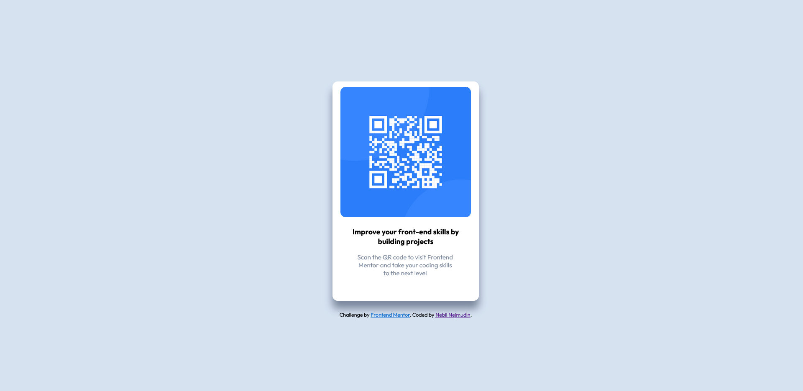

# Frontend Mentor - QR code component
    This is a solution for the Frontend Mentor challenge for the QR code component.

## Table of contents
- [Overview](#overview)
  - [Screenshot](#screenshot)
  - [Links](#links)
- [My process](#my-process)
  - [Built with](#built-with)
- [Author](#author)

## Overview

### Screenshot
    

- Live Site URL: []

# My process 

### Built with

- Semantic HTML5 markup
- CSS
- Flexbox

# Author

- Frontend Mentor - [@Nebil-Nej]

